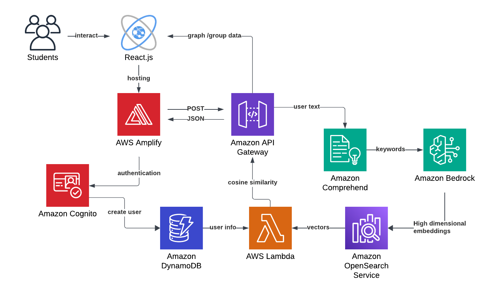

# MapMatch

We built a simple web application that facilitates roommate matching with advanced AI integrations in just 6 hours!

The idea is inspired by RAG (retrieval augmented generation) models, which are a combination of retrieval-based and generation-based models. We compute high dimensional embeddings for user profiles and store them in a vectorDB for efficiency. Then we use algorithms such as cosine similarity and L2 norm to find the k most similar profiles. These are then graphed to show the connections between users.

## The idea

- Existing roommate matching relies on limited criteria and lacks personalization.

- NLP can process user descriptions, eliminating the need for tedious forms.

- Linear algebra and NLP enable matching based on profile similarity.

- Graphs provide a clear, comprehensive view of user connections, replacing traditional tables.
